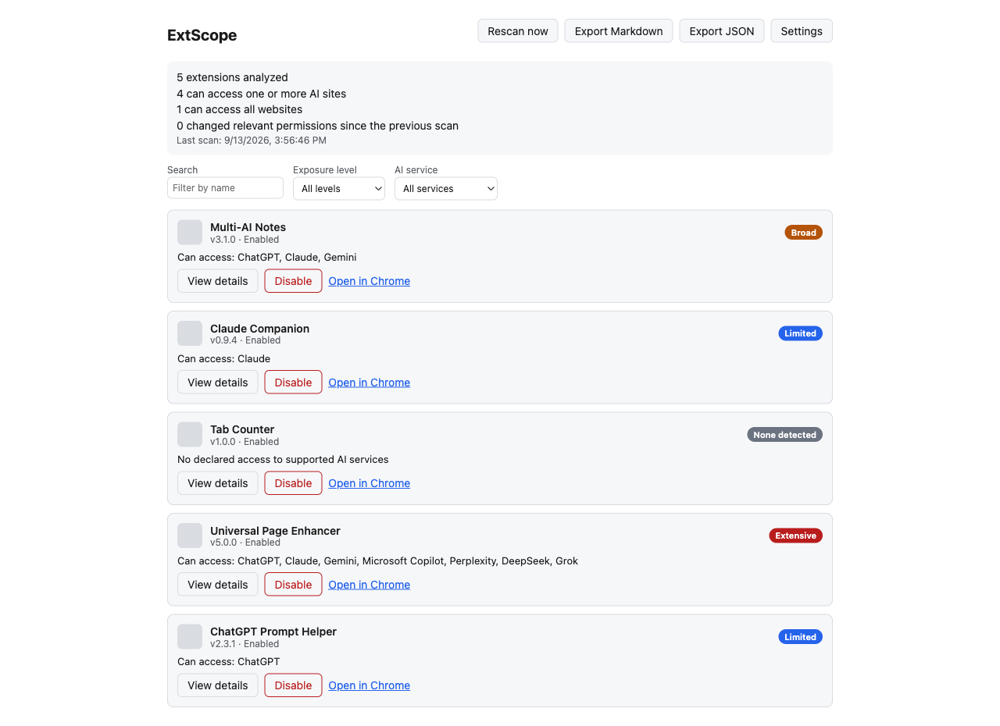

# ExtScope

> See which Chrome extensions can access your AI conversations — before you paste something confidential.

Every time you open ChatGPT, Claude, or Gemini, any other extension you've installed — a coupon finder, a
screenshot tool, a note-taking app, anything — might have declared permission to read or modify that page.
Most people have no idea which of their extensions can do this, or why.

**ExtScope scans your installed Chrome extensions and shows you, in plain English, exactly which ones can
see your AI conversations and why** — based on each extension's declared permissions, not guesswork.



## At a glance

- **See every extension** with access to ChatGPT, Claude, Gemini, Copilot, Perplexity, DeepSeek, or Grok
- **Evidence, not accusations** — every finding cites the exact permission or host pattern behind it
- **Plain-English exposure levels** — None detected, Limited, Broad, Extensive, or Changed — no mystery score
- **Change tracking** — get flagged when an extension quietly gains new access
- **Act immediately** — disable a risky extension right from the dashboard
- **100% local** — no accounts, no analytics, no server; nothing about your extensions ever leaves your device

## Important limitation

This tool reports **capability and exposure**, not proof of malicious behavior. An extension with access
to an AI website may use that access legitimately. Every result explains the evidence behind it and never
labels an extension malicious from permissions alone.

## What it does not do

- Does not read your prompts, responses, or any AI page content
- Does not intercept or store AI conversations
- Does not perform network-traffic or behavioral monitoring
- Does not upload your installed-extension list anywhere
- Does not automatically uninstall anything
- Has no accounts, analytics, or remote servers

## How it works

```text
Chrome Management API
        |
Extension Inventory Adapter        (src/background/inventory.ts)
        |
Permission Normalizer              (src/core/normalize-permissions.ts)
        |
AI Exposure Rules Engine           (src/core/exposure-engine.ts)
        |
Snapshot / Change Detector         (src/core/change-detector.ts)
        |
Dashboard + Exporter               (src/ui, src/export)
```

Exposure levels are descriptive, not a mysterious numeric score:

- **None detected** — no declared access to a supported AI domain
- **Limited** — access to one specific AI domain
- **Broad** — access to multiple AI domains, or a broad HTTP/HTTPS host grant
- **Extensive** — access to all websites combined with a powerful capability (scripting, clipboard, etc.)
- **Changed** — newly added relevant access since the previous scan, flagged for review

## Installing

Not yet published to the Chrome Web Store — for now, build it from source:

```bash
git clone https://github.com/deeneshchowdhary/extscope.git
cd extscope
npm ci
npm run build
```

Then in Chrome: open `chrome://extensions`, enable **Developer mode** (top right), click **Load
unpacked**, and select the `dist/` folder that was just created. Pin it to the toolbar and you're set.

## Development

```bash
npm install
npm test              # unit tests (Vitest)
npm run lint          # ESLint
npm run build         # type-checks and produces dist/
npm run dev:web       # preview the popup/dashboard at http://localhost:3005 with mocked chrome.* APIs
npm run test:integration  # loads the real dist/ build into real Chromium (see below)
```

### Real-browser integration tests

`npm run dev:web` previews the UI against a mock of `chrome.management`/`chrome.storage`/`chrome.tabs`
(`src/dev/chrome-mock.ts`), which is fast but can't exercise real extension lifecycle events. `npm run
test:integration` instead loads the actual `dist/` build into real headless Chromium (via Playwright) next
to a minimal fixture extension (`tests/fixtures/dummy-chrome-extension/`) and drives it as a user would —
onboarding, scanning, disable/enable, export downloads, data deletion — asserting along the way that no
network requests leave the extension's own origin. Run `npm run build` and `npx playwright install
chromium` once before using it.

## Project structure

```text
src/
  background/   service worker, extension inventory adapter, lifecycle monitor
  core/         framework-independent risk-analysis engine (types, rules, engine)
  data/         chrome.storage.local repositories for snapshots and settings
  ui/           popup and dashboard (React)
  export/       Markdown and JSON report exporters
tests/
  unit/         Vitest unit tests for the core engine and exporters
  fixtures/     fabricated extension manifests used across tests
```

## Privacy and permissions

| Permission   | Why it is needed                                                        |
| ------------ | ------------------------------------------------------------------------ |
| `management` | Required to list installed extensions and their declared permissions.    |
| `storage`    | Stores scan snapshots and settings locally, on-device only.              |

That's the whole list — no `tabs` permission is requested. `chrome.tabs.create()` (used to open Chrome's
extension-management page and the onboarding tab) doesn't require it unless the extension reads a tab's
`url`/`title`/`favIconUrl` back, which this one never does.

All analysis runs locally. You can delete all stored data at any time from the dashboard's Settings panel.

## Releasing

Every release is a reproducible build from a clean checkout, with a published SHA-256 checksum. See
[docs/RELEASING.md](docs/RELEASING.md).

## Contributing

See [CONTRIBUTING.md](CONTRIBUTING.md). Please report security issues privately per
[SECURITY.md](SECURITY.md) rather than filing a public issue.

## Privacy

See [PRIVACY.md](PRIVACY.md) — the short version: nothing is collected, nothing is transmitted, no
accounts, no servers.

## License

MIT — see [LICENSE](LICENSE).
